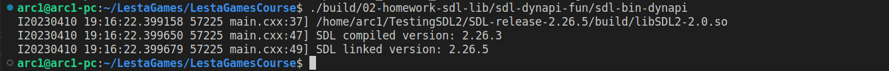

# [SDL DYNAMIC API](https://github.com/libsdl-org/SDL/blob/main/docs/README-dynapi.md) mechanism



## Steps to reproduce this mechanism

Firstly, you should export `SDL_DYNAMIC_API` environment variable:

```
export SDL_DYNAMIC_API=/some/path/to/library/needed
```

FYI, you can check if exporting finished successfully by printing `export` in terminal. Thus you will be able to see the list of all environment variables. 

Then just run executable and enjoy it:)
