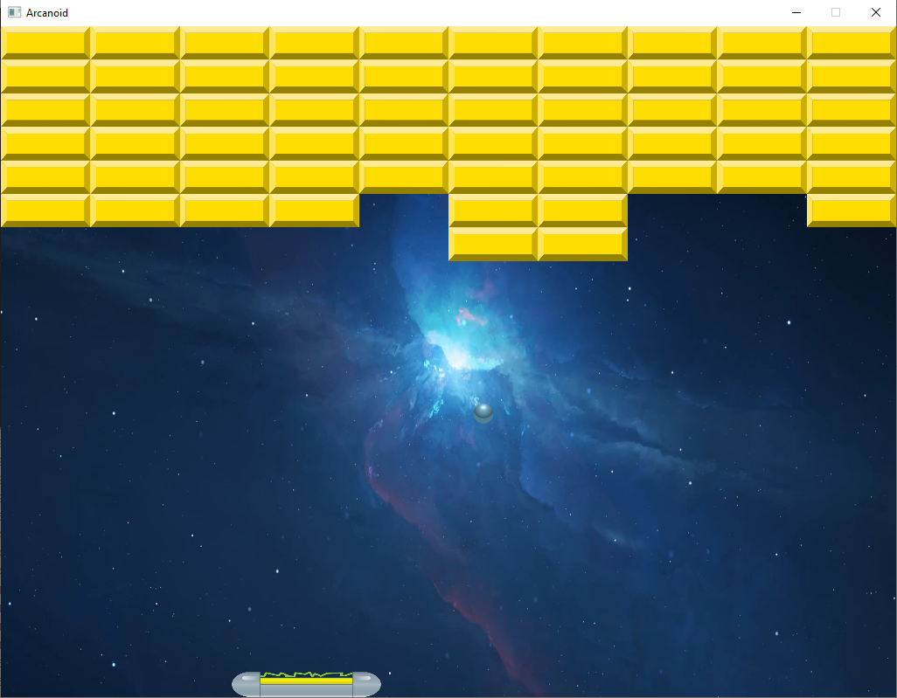
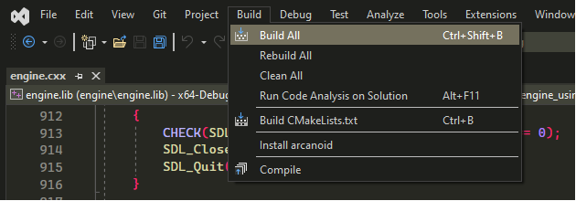

# Arcanoid game

Build Platform          |
------------------------|
Linux x64(gcc, clang)   |
Windows x64(MSVC, LLVM) |



## Build steps for Windows

### Using LLVM compiler infrastructure

First of all make sure you have installed llvm. Use [`this`](https://github.com/llvm/llvm-project/releases/tag/llvmorg-15.0.7) link to download exe needed.
You may also need for [`ninja`](https://github.com/ninja-build/ninja/releases)
And of course [`cmake`](https://cmake.org/download/#latest)

```
git clone --recurse-submodules https://github.com/ArthurBandaryk/LestaGamesCourse.git
cd LestaGamesCourse/arcanoid
cmake -B build -G "Ninja" -S .
cmake --build build

```

To `run` this game just do the following:

```
cd build && arcanoid.exe

```

### Using MSVC

First of all clone [`this`](https://github.com/ArthurBandaryk/LestaGamesCourse) repo:

```
git clone --recurse-submodules https://github.com/ArthurBandaryk/LestaGamesCourse.git

```

Then you can open arcanoid folder with Microsoft Visual Studio:


After that you should press `CTRL + S` on the root `CMakeLists.txt` (arcanoid/CMakeLists.txt) to generate build files.

Then just press `Build` button:



Then click `Run` button and enjoy it:)
